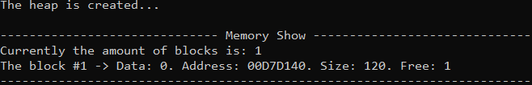
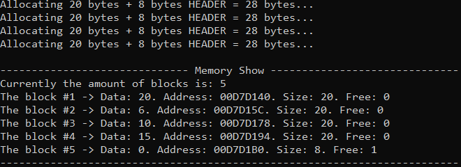
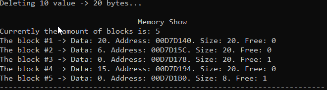

# Memory Allocator
### Description
Implementing the basic work of memory allocators.  
The algorithm suggests we have a continuous part of memory. There, we can allocate different **blocks**. The functions uses the pointer arithmetic to move between the blocks.

Each block has a **header** and the **data**. **Header** always has a fixed size of 8 bytes.   
That means, to allocate ***10 bytes*** of memory, we need at least ***18 bytes*** of free memory.
The structure of **header**:   
> **[current block size : 2 bytes | previous block size : 2 bytes | data is occupied : 1 byte | placeholder : 3 bytes]**
### Functions  
#### `void* mem_alloc(size_t size)` function
When the `mem_alloc` function is called,
it searches for the smallest block of free memory, satisfying the `size` criteria (the size of that free block has to be at least `size + HEADER_SIZE`).
If it found such - it splits the block into the 'taken for allocation memory' block and the 'free memory left' block.
If it didn't - it returns the `nullptr`.
#### `void* mem_realloc(void* addr, size_t size)` function
This function call first of all decides, if it has to make the block smaller or bigger.   

**If the block is going to become smaller**, the current memory block will be splitted into two: the 'new data' block and the 'freed memory' block.
Then the `mem_free` function is called ('freed memory' block pointer is passed there as an argument).    
    
**If the block is going to become bigger**, first of all, it is analyzed, if the memory block can "overflow" to the adjacent block of free memory
 (if they exist). If it's not possible, the `mem_alloc` function is called to find the free memory block with enough free memory and the data is copied
to the new block. The old block data is deleted, the `mem_free` is called with the old block data pointer passed as the argument.
#### `void mem_free(void* addr)` function
The function deletes the data of the block, flags it as the 'free memory' block and tries to merge with adjacent 'free memory' blocks, if present.

## Test

#### The creation of the 'default' sized 'heap' with 128 bytes of memory (8 bytes are immediately taken for the header)
##### Code
```  
MemoryAllocator allocator;     
   
allocator.mem_show();    
```
##### Output

#### The allocation of 4 blocks with a size of 20 bytes
##### Code
```
int* test1;
test1 = (int*)allocator.mem_alloc(20);
*test1 = 20;

int* test2;
test2 = (int*)allocator.mem_alloc(20);
*test2 = 6;

int* test3;
test3 = (int*)allocator.mem_alloc(20);
*test3 = 10;

int* test4;
test4 = (int*)allocator.mem_alloc(20);
*test4 = 15;  
   
allocator.mem_show();    
```
##### Output



#### The `mem_free` call for one of the previously created blocks of memory.
##### Code
```
allocator.mem_free(test3);

allocator.mem_show();
```
##### Output



#### The reallocation of one of the previously created blocks of memory to size 25.
##### Code
```
test2 = (int*)allocator.mem_realloc(test2, 25);  
   
allocator.mem_show();    
```
##### Output

